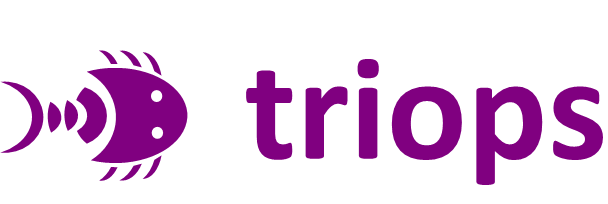
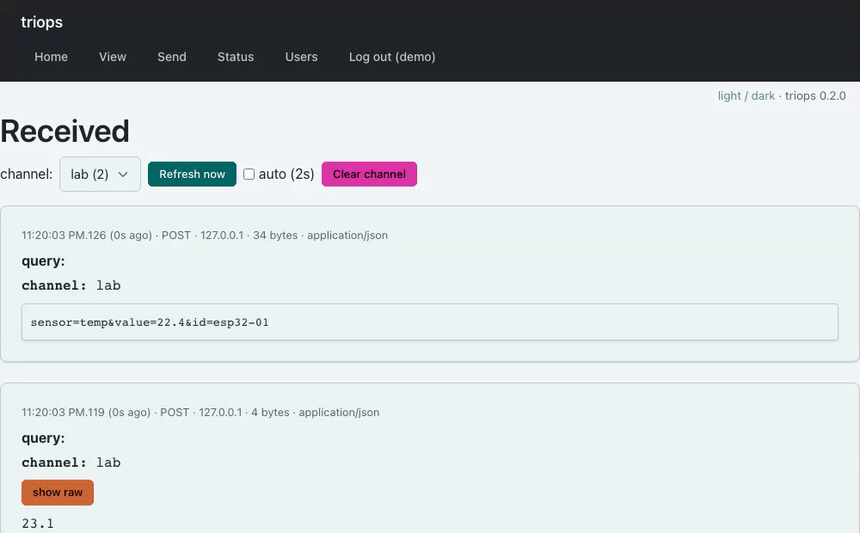

<p align="center">
  
</p>

<p align="center">
  <a href="https://github.com/deftio/triops/actions"></a>
  <a href="./LICENSE.txt"></a>
  
  
</p>

# triops

A small web server for looking at what your hardware is actually sending.

You have a board on your desk. The firmware posts a sensor reading somewhere. It
is not arriving, or it is arriving wrong, and you cannot tell whether the problem
is the WiFi, the HTTP client, the JSON encoder, a Content-Type header nobody set,
or a payload that got truncated at 512 bytes.

triops is the other end of that connection. Point the board at it and it shows
you the bytes it received, the headers that came with them, and when they
arrived. Unzip it into a web directory and it runs — no database to install, no
services to start, no build step, no dependencies.

```
$ curl -X POST 'http://192.168.1.40/triops/api/ingest.php?channel=lab' \
       -H 'Content-Type: application/json' \
       -d '{"device":"esp32-01","temp_c":22.4}'
{"ok":true,"api":1,"data":{"channel":"lab","bytes":35,"stored":true}}
```

...and it is on screen, parsed, with the raw bytes one click away.



## Where this fits

Somewhere between blinking an LED and having a real backend.

Early on you are not testing your telemetry pipeline, you are testing whether the
board can form a correct HTTP request at all. Standing up a real service to find
that out is a detour, and pointing the board at a cloud endpoint means the
failure is now somewhere in someone else's logs. What you want is a target on
your own network that answers immediately and hides nothing.

That is the whole job. triops runs on a Raspberry Pi, a NAS, an old laptop, or
whatever shared host you already pay for. It works on a lab network with no
internet connection. Nothing leaves your machine.

**It is not a production telemetry backend.** There is no clustering, no
retention policy, no alerting, no TLS termination, no multi-tenancy. It keeps
the last few hundred payloads per channel in a ring buffer and drops the rest.
When you outgrow it you are supposed to outgrow it — by then you know exactly
what your device sends, which was the point.

## Install

Four steps, and none of them is "edit a config file".

1. Download [the latest release](https://github.com/deftio/triops/releases/latest/download/triops.zip) and unzip it into a web-served directory
2. Open it in a browser — it asks you to create an account
3. Point your device at `api/ingest.php`
4. Watch it arrive on the **View** page

Requirements: PHP 8.0 or newer, and a directory the web server can write to.
SQLite is used when it is available and a plain append-only text file when it is
not, so there is nothing to install either way.

See [docs/install.md](./docs/install.md) for nginx, shared hosting, and moving
the data directory out of the web root.

## What is in it

The debug endpoints return plain text, deliberately. A device with a 2 KB HTTP
client should not have to parse JSON to find out whether its clock is right.

| Endpoint | What it does |
|---|---|
| `timestamp.php` | Server time to microseconds |
| `sum.php?a=1&b=2` | Adds the numbers you pass. Proves your query string survived |
| `ip.php` | Your address as the server sees it |
| `echo.php` | Your whole request, played back: method, headers, query, body |
| `headers.php` | Just the headers — for when a proxy is in the way |
| `delay.php?ms=2000` | Answers slowly, so you can test client timeouts |
| `code.php?c=500` | Answers with the status you ask for, so you can test error paths |
| `bytes.php?n=4096` | Returns exactly N bytes, so you can find your receive buffer limit |

The inbox and the JSON API sit alongside them:

| Endpoint | What it does |
|---|---|
| `api/ingest.php` | POST anything. The canonical device endpoint |
| `api/read.php` | Last N entries as JSON |
| `api/version.php` | Name, version, API integer. No auth — for feature detection |
| `api/status.php` | Which store is live, is the data directory writable, versions |
| `api/clear.php` | Empty a channel |
| `view.php` | The inbox, newest first, parsed with a raw toggle |
| `send.php` | Post a payload from a form, before the hardware exists |
| `status.php` | The same diagnosis as `api/status.php`, rendered |

Full reference: [docs/endpoints.md](./docs/endpoints.md) and [docs/api.md](./docs/api.md).

## Talking to it from a device

```cpp
// ESP32 / Arduino
HTTPClient http;
http.begin("http://192.168.1.40/triops/api/ingest.php?channel=lab");
http.addHeader("Content-Type", "application/json");
int code = http.POST("{\"temp_c\":22.4}");
Serial.println(http.getString());
```

```python
# MicroPython
import urequests
urequests.post("http://192.168.1.40/triops/api/ingest.php?channel=lab",
               json={"temp_c": 22.4})
```

More, including error handling and the plain-text primitives:
[docs/examples/](./docs/examples/).

## Adding your own page

Copy a template, edit it. A new endpoint is about five lines:

```php
<?php
require __DIR__ . '/lib/triops.php';

t_text("hello\n");
```

HTML pages get a bitwrench UI, a nav bar, and dark mode without writing any CSS.
[docs/hacking.md](./docs/hacking.md) walks through all three templates.

## Security

triops is built for a bench, a lab network, or a machine behind a VPN.

It has password-protected accounts, CSRF protection on every form, bcrypt
hashing, and it ships with no default credentials — but it has no rate limiting,
no audit log, and no hardening against a hostile internet. Do not put it on a
public address and post real data through it. If you must expose it, set
`ingest_key` in config and put it behind something that terminates TLS.

## Built with

The interface is [bitwrench](https://github.com/deftio/bitwrench) — a
zero-dependency UI library that builds pages from plain JavaScript objects with
no build step, which is why triops has a copy vendored in `app/assets/` and still
works on a network with no internet. If you like how the UI here goes together,
that is where it comes from.

## License

BSD 2-clause. © 2020–2026 M A Chatterjee.
